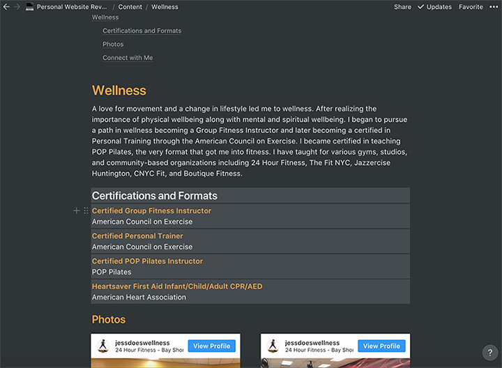
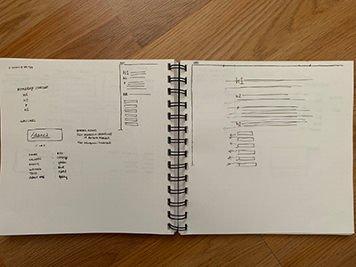
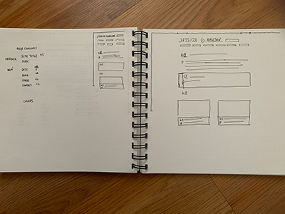

## The Great Gatsby(.js) Portfolio Revamp

As I approached my 100th day of the #100DaysOfCode challenge, I thought to myself, “What can I do to make this moment memorable?” After a week of both vulnerability and validation plus solid advice that encouraged me to both blog and work on my portfolio, I thought, “Why not try to build a portfolio in 24 hours?”

My portfolio was up for a revamp as my goals in tech changed, going from freelancing goals to aiming for a full-time role as a web developer. I also wanted to take on a project where I can learn something new so I thought this was a great opportunity to do both at once! I had been interested in learning Gatsby.js, which also meant learning React and GraphQL along the way. I had even attended a Gatsby meetup a few days before I decided to take on this project. There they spoke about what makes Gatsby "blazing fast," and they even live-coded a portfolio site! While some things went over my head, I found the meetup incredibly interesting and was set on completing this project!

So why 24 hours? Well, I wanted to go out with a bang for #100DaysOfCode. Also, the Puttytribe, an online community for multipotentialites, was hosting its biannual Puttython- a celebration of doing whatever you'd like for 24 hours! The two coincidentally landed on the same day so I thought it was perfect. Not to mention, I had went to that Gatsby workshop and also [Andrew Mead's bootcamp tutorial](https://www.youtube.com/watch?v=8t0vNu2fCCM) just came out- so Gatsby and I were meant to be! I called it "The Great Gatsby Puttython Hackathon!"  

Unfortunately, the results were tragic, but not as tragic as the Great Gatsby himself. I did not finish my portfolio site nor did I even finish the 4-hour course in a day. It ended up spanning a month. And while I did not reach my initial goal, I am incredibly proud of the final outcome.

## Content

The first step in the portfolio revamp was to gather all the content. When it comes to projects, I tend to get ahead of myself and start coding things right away without giving much thought to the content. But as I learned when creating my previous personal website, content is key, and thinking about who your users are (yes, even for a personal website) is a critical part of the project.

In this case, moving away from wanting to be a freelance web designer and developer to desiring a full-time role as a front-end web developer led me to rethink my website's content. This site was to be less service-based and more information-based. I also wanted a site to showcase all my passions as well as the past work that I've done rather than emphasizing what future services I could offer across all disciplines. 

I gathered my content using Notion, an organization and note-taking platform that lets users create and organize in any way that they prefer. In this instance, I used subpages to create content, drafting each of the website's pages as documents. Other than content gathering and management, this would be also helpful in ensuring content was accessible. I made sure that each document followed a logical heading and content structure and that information presented was easy-to-read and not too lengthy. Notion also allows for a bit of layout and color, so I was able to test color accents and two-column layouts in the process while also using a table of contents to check that the structure was still in place.

<figure>
    
    <figcaption>Image: The content subpage for "Wellness" with a Table of Contents. Each page displays all planned content to be shown on the actual site.</figcaption>
</figure>

## Design

The design phase involved a few steps but one important step was to establish a design system with a style guide and a component library. This helps in not only keeping consistency in the final product but it also helps for a quicker development process. Also, I find design systems fascinating and this gave me an opportunity to explore how the world of design and development comes together.

I began with creating paper and digital wireframes. I wanted a minimalist layout that focused on the content. I knew I wanted my website to be work across all browser sizes, so decided my site should be designed mobile-first. With my paper wireframes I was also thinking proactively, thinking of web accessibility and reusable components.

<figure>
    
    <figcaption>Image: Paper wireframe for the front page, featuring sketches of its mobile and desktop designs, as well as a few sketches of possible reusable components.</figcaption>
</figure>

<figure>
    
    <figcaption>Image: Paper wireframe for the pagea, featuring sketches of its mobile and desktop designs.</figcaption>
</figure>

Before going into the digital wireframe, I wanted to define patterns in my content - document structure, heading and text structure, repetitive elements (components), etc. 

### Document Structure

<mark><em>Subsection coming soon, thanks for your patience!</em></mark>

### Colors

<mark><em>Subsection coming soon, thanks for your patience!</em></mark>

### Text Stylings

<mark><em>Subsection coming soon, thanks for your patience!</em></mark>

### Components Pre-Development

<mark><em>Subsection coming soon, thanks for your patience!</em></mark>

## Development

<mark><em>Section coming soon, thanks for your patience!</em></mark>

### Installation & First Components

<aside>

#### Git & GitHub

</aside>

### Styling with Sass & CSS Modules

<aside>

#### Learning How to Use @import and SCSS Partials

</aside>

### Plugins

<aside>

#### SEO & Metadata

</aside>

<aside>

#### Manifest & Progressive Web Applications

</aside>

### Content Management, Data, & GraphQL

<aside>

#### Querying Data from Multiple Sources

</aside>

<aside>

#### Pragmatically Rendering Pages

</aside>

## Deploying

<mark><em>Section coming soon, thanks for your patience!</em></mark>

### Deploying with Netlify and Managing Domain Names

## QA

<mark><em>Section coming soon, thanks for your patience!</em></mark>

## In Summary
In a month's time, I was exposed to new technologies, which I had little to no experience with: 

1. Gatsby.js
2. React.js
3. Sass/SCSS
4. CSS Modules
5. Markdown
6. GraphQL
7. Node.js
8. npm

Plus some others including Adobe XD for design and Notion for note-taking! I also learned a lot about how I learn, how I solve problems, and how I retain information.

Learning Gatsby was by far an enjoyable experience, thanks to superb documentation, the 4-hour bootcamp, and a team and community that rallies around a great product. I was able to find solutions to problems pretty quickly, and I even began solving some own issues on my own. It was a great way to learn React without thinking too much about setting things up, and I never imagined I would enjoy GraphQL as much as I did.

Overall, I not only learned a lot of things, but I ended up creating a site I am incredibly proud of. My original idea was to make a simple tech portfolio, but soon enough, I wasn't satisfied with just showing off my tech skills. I am incredibly proud of all the things I've done in all other aspects of my life and career, so I wanted to show them in a way I had yet achieved. I am proud of learning new things, creating a great site, and after looking back at all I've done, I'm proud of all I've done and look forward to my bright future.