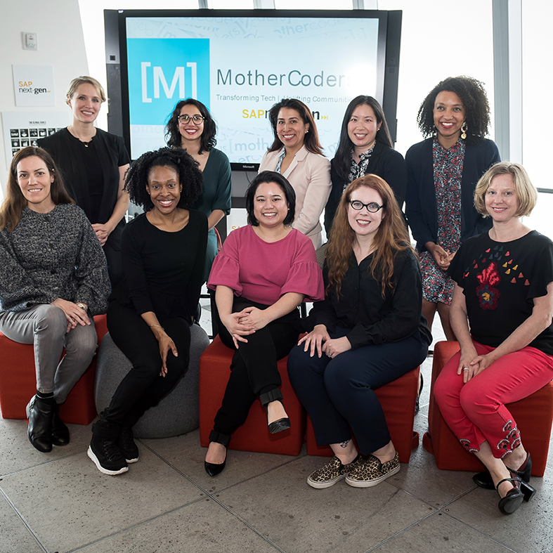
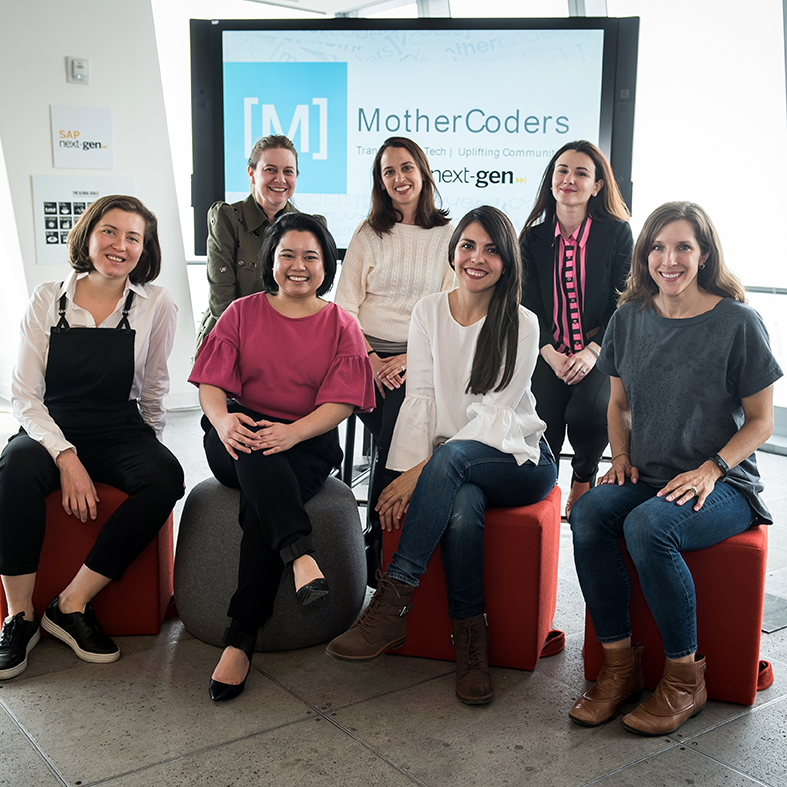
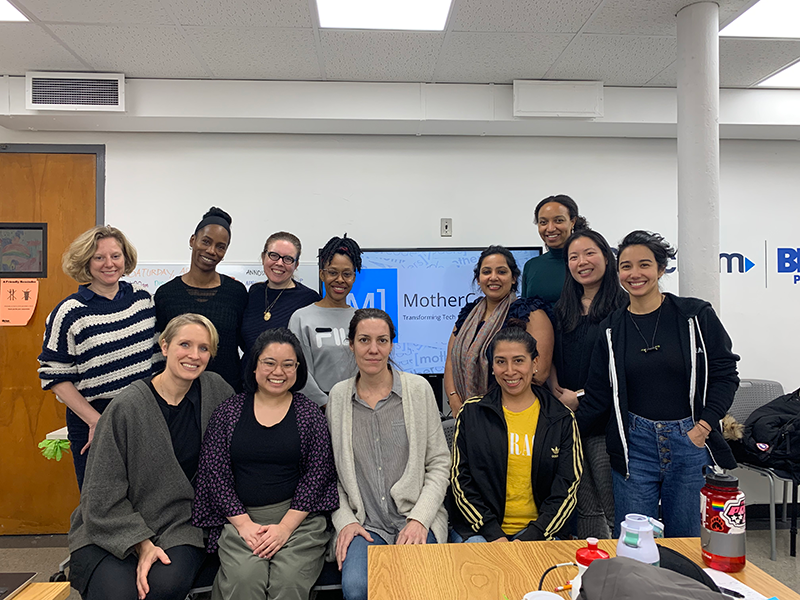
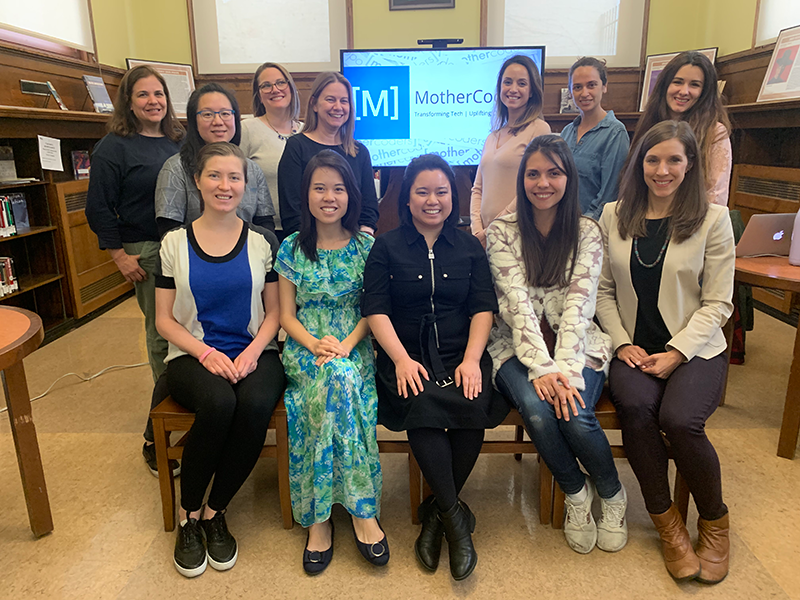
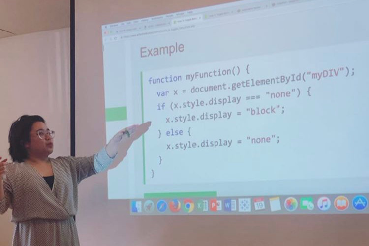
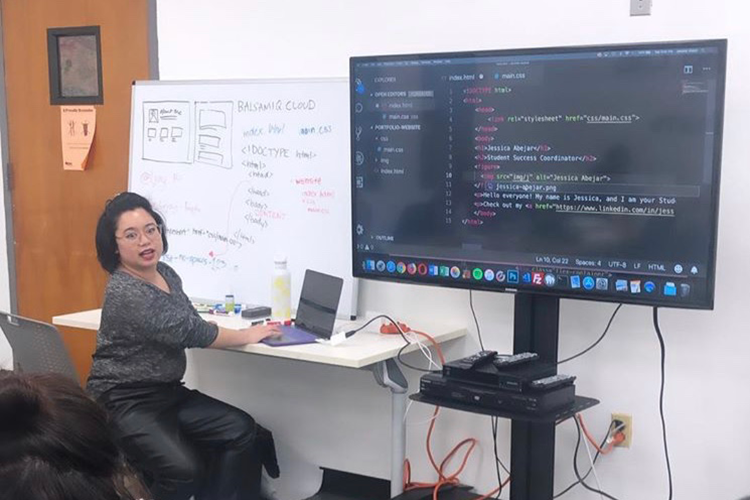
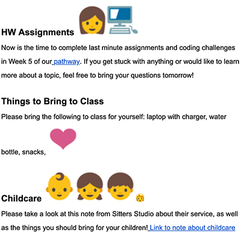
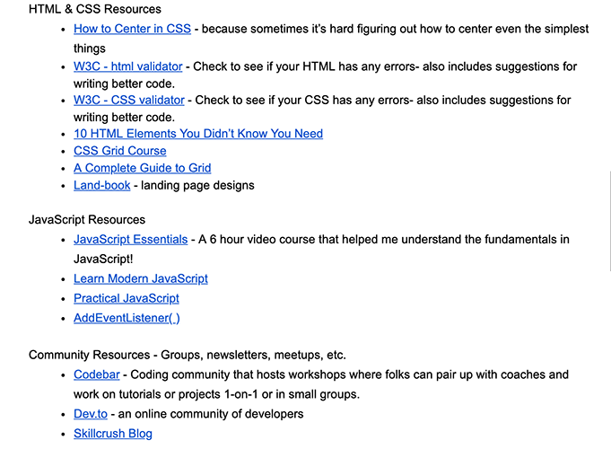
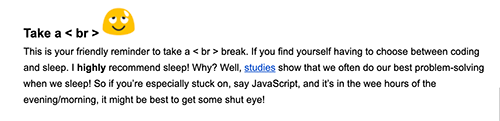

## Creating a Space Where We Can Build Code, Community, & Confidence

Before MotherCoders I had been integrating tech into my multifaceted life by learning to code for a little under a year. As I started stepping away from my online coursework and into the real world, I had been surrounding myself with organizations and people who support women in tech, especially those from non-traditional backgrounds.

These spaces I found myself in were so welcoming and so patient with me as I was learning that it inspired me to do the same for my peers. I wasn’t sure of the direction where I wanted to go in tech, but I knew I wanted to give back to the community and create a space where folks can learn openly and freely without fear or shame, where they can grow, connect, and learn to love tech.

<blockquote>I knew I wanted to give back to the community and create a space where folks can learn openly and freely without fear or shame, where they can grow, connect, and learn to love tech.</blockquote>

This is where MotherCoders came in. MotherCoders was hiring for the role of Student Success Coordinator for their inaugural NYC cohort. The role was _so_ me - a TA role mixed with class coordination - and yet I hesitated, wondering if I was skilled enough to help others learn. Even with most but not all qualifications met (most of my "met" qualifications were in coordination and logistics), I just closed my eyes and hit send.

Three months later, I couldn’t have been more in love with my job. Not only did I get to do all the coordinating and logistical stuff I love to do but I also got to share my love for coding with these moms, even leading a few classes myself!

    <figure>
        
    </figure>
    <figure>
        
    </figure>

The true joy was seeing these AMAZING women grow in ways beyond their tech skills! I saw them connect with each other and saw them thrive. I saw already accomplished, already amazing, already groundbreaking women
- be vulnerable;
- hold each other up and hold each other accountable;
- call out sexism and agism;
- speak about motherhood freely without hesitation take pride in their work;
- and, most importantly, build confidence.

## About MotherCoders
[MotherCoders](https://mothercoders.org) is a non-profit organization that is "growing the tech talent pool by helping women with kids gain the skills, knowledge, and connections they need to thrive in today's digital economy." Through a 9-week program, MotherCoders provides opportunities to learn from and meet with industry professionals, learn about the tech industry, and learn foundational skills in front-end web development. MotherCoders provides a classroom experience with guest speakers and coaches as well as on-site childcare. MotherCoders also organizes a field trip at a tech company, and at the end of the 9-week program, the students take part in Demo Day and share their final projects (a portfolio or other website) to their fellow students, families, friends, MotherCoders leadership team, cohort partners, and many others.

### MotherCoders NYC

In Spring 2019, MotherCoders led their first program in New York City, partnering with Google and [women.nyc](http://women.nyc) (previously through the Office of the Deputy Mayor). Classes were held at branch locations in the Brooklyn Public Library system. From over 265 applicants, twenty-four students from all over New York City were chosen to participate. These women came from all different backgrounds, held at least a bachelor's degree, and had previous work experience. They had backgrounds in education, research, marketing, graphic design, project management, IT, linguistics, finance, and more.

<aside>

[Check out this feature story on MotherCoders NYC by News 12 Brooklyn!](http://brooklyn.news12.com/story/40006485/nonprofit-teaches-coding-to-mothers-in-brooklyn)

</aside>

Over the course of the program, they learned from experts in design thinking, UX/UI design, software engineering, digital marketing, project management, data science, cybersecurity, and more. They also visited SAP Next-Gen's Innovation Center at Hudson Yards and met with a panel of women working in tech. Demo Day was hosted by Pivotal. By the end of the program, we graduated our students, with close to 25% of our cohort receiving job offers before the end of the program. Many of the students continued with their learning and have applied to bootcamps as well as apprenticeships, internships, and returnships in technical roles.

    <figure>
        
    </figure>
    <figure>
        
    </figure>

## About the Role

The Student Success Coordinator role was created specifically for the NYC cohort as the leadership team is located outside of the NYC area. The Student Success Coordinator served as the on-the-ground coordinator for the program: organizing classes with guests, childcare, and other aspects including lunch and media visits. The Student Success Coordinator's main role, however, was to provide support to the Course Manager and students with their coursework and projects but also provide encouragement and inspiration along the way.

### Student Success

A large part of ensuring student success was creating the right environment for our moms to thrive in. This meant
- **setting the stage**: connecting with our vendors and contacting library branch managers if needed; arriving earlier to set-up and leaving later to clean-up; organizing childcare; etc.
- **having the right attitude**: being patient and willing to help; providing positive and constructive feedback; helping in-class and outside the classroom; keeping focus while troubleshooting code or program features.

I really aimed to make the learning experience a delightful one for our students. Here are a few examples of how I ensured student success:

#### In-class Support

I supported our Course Manager and students with their coursework as a TA but I also had a few opportunities to lead a few coding lessons! While following online tutorials was part of the curriculum, I saw the need and desire for in-class teaching. What was especially helpful for our students was being able to see how all the moving parts came together; I showed that frequently.

For example, when teaching JavaScript, their online tutorials taught the fundamentals while I showed how fundamentals can be applied to their websites, using JavaScript functions to manipulate the DOM. 

Other things I introduced in the classroom include:
- semantic HTML and basic website structure;
- CSS specificity and intros to flexbox and grid;
- setting up their development environments;
- and setting up Git and working with GitHub.

I assisted them individually with projects and showed them how to debug, troubleshoot, and validate their code.

    <figure>
        
    </figure>
    <figure>
        
    </figure>

<aside>

##### What Students are Saying

<blockquote>"Jessica’s teaching approach was refreshing, it was such a pleasure coming in every Saturday to an energetic mindset. When learning technical concepts, it’s very helpful to have someone explain in non-technical terms. In addition, she went above and beyond in providing supportive resources to ensure the learning modules were grasped. She took time to develop a relationship with her students, which built trust. That allowed me to approach her any time I had questions or needed help. Jessica has a very professional and empathetic demeanor a perfect combination for any opportunity she is given."</blockquote>
Erica Ramirez, Student at MotherCoders NYC Spring 2019

<blockquote>"Jessica is a multitalented professional and an extraordinary human being. She was my success coordinator and instructor at MotherCoders. Jessica was the core of our cohort, she always kept us organized, inspired, motivated and had a solution to any problem that came along. Jessica was not only amazing at coordinating us but she was also a phenomenal mentor, whose help was crucial in our learning process. She is a very talented, self-taught web developer who went above and beyond to assist and guide our cohort while learning HTML, CSS and Javascript."</blockquote>
Stanislava Hristova, Student at MotherCoders NYC Spring 2019

</aside>

#### Support Outside the Classroom

One of the biggest things that I did for my students was provide two weekly emails. The first was an email that introduced the class of the week: introducing any guest speakers or coaches; reminding them to complete their homework; sharing information from our childcare providers; lunch for the week; and any travel advisories.

<figure>
    
</figure>

The second was a midweek email with any important class announcements and dates but also a weekly resources roundup. Any resources mentioned by guests, shared in class, shared in Slack, or that I found useful for the week's lessons were included in the email. Students really looked forward to these weekly emails and was a highlight of their week!

<figure>
    
</figure>

Another feature of my emails were the tone it set. I often included fun GIFs to help bring a smile on students' faces, and I included a segment called "**take a < br >**", which encouraged students to take a moment to pause and step away from their learning and projects every once in a while.

<figure>
    
</figure>

I was also available for homework and project help. In particular, for Demo Day, we chose four students to present their projects, and in preparation, I offered to help them with their talking points. I listened to their presentation and offered feedback to make them more impactful and personal. For example, one of our students Shiela created a tool that she used in her classroom so I encouraged her to mention that in her presentation.

<aside>

##### What Students are Saying

<blockquote>"As our group's Student Success Coordinator, Jessica made sure that all these goals are reached. She assisted us with our coursework and projects, arranged onsite childcare, coordinated with guest speakers and media, as well as curated weekly informational emails and the MotherCoders Slack channel. Jessica was integral to the success of the program."</blockquote>
Svetlana Shammasova, Student at MotherCoders NYC Spring 2019

<blockquote>"Honest, helpful, collaborative, problem solver--these are just a few of the traits I would use to describe Jessica, my Student Success Coordinator at MotherCoders. Not only did she help me find ways to solve coding challenges on my own, but she would always go above and beyond in ensuring that we were successful in learning HTML/CSS/JavaScript. She did this by curating a list of helpful websites, videos, books, game-like exercises, and coding challenges to help us learn the material. She is well-versed in programming and troubleshooting code. Jessica is patient and articulates concepts well. She also provides excellent feedback for presentations."</blockquote>
Shiela Lee, Student at MotherCoders NYC Spring 2019

</aside>

### Team Collaboration & Communication

As the on-the-ground coordinator for a distributed team, our leadership team depended on the Course Manager and me to make sure that the program was running smoothly. I took care of all the day-to-day logistical aspects of the program and helped drive the in-class sessions. If challenges arised, I would communicate with my team, often brainstorming solutions. But if an immediate matter would arise, I would communicate with my team immediately and proceed to handle the situation head-on; I was not afraid to step up to the occasion, if need be.

<aside>

#### What My Team is Saying

<blockquote class="twitter-tweet">
<a href="https://twitter.com/_jessicode?ref_src=twsrc%5Etfw">@_jessicode</a> is the best thing that&#39;s happened to us since onsite childcare <a href="https://t.co/WH07nYC1XL">https://t.co/WH07nYC1XL</a>
&mdash; MotherCoders (@MotherCoders) <a href="https://twitter.com/MotherCoders/status/1118962370926092288?ref_src=twsrc%5Etfw">April 18, 2019</a></blockquote> 

</aside>

Our team would often have weekly conference calls. To keep the leadership team updated with certain aspects of the program, I created the "Master List," a shared spreadsheet workbook that included information including:
- a one-page program summary;
- student summary and attendance roster;
- children summary and roster;
- information on guest speakers and proposed topics;
- lunch orders and budget; supplies list;
- and more.

We also included evaluation guidelines in the workbook. The workbook was an accessible way for our team to communicate and keep track of all aspects of the program.

## Challenges

As with any pilot program, there were a few challenges present. Having had experiences with organizations and programs in their early stages, I had anticipated any possible challenges as soon as I took on the role. This kept me on my toes and ready to act as a liaison between multiple parties including a remote leadership team and local partners. Not only was this a new location for MotherCoders but this was also one of the largest cohort sizes that the organization had. With this in mind, our team had to be adaptable and evaluation was critical. My role required viewing the program as a whole from the perspective of many stakeholders with our students being at the forefront. My role was not only about ensuring the success of our students but also the success of the program.

## In Summary

MotherCoders was an incredible experience to be a part of and I was glad that I was able to make an impact on these women's lives. It gave me the opportunity to work with all my talents from project coordination to coding and even helped me become better at both. It was a joy to witness these women and this organization grow.

<aside>

### What Students are Saying 

<blockquote>"Jessica is a wonderful and thoughtful teacher, her approach to teaching web development is comprehensive and direct. She cares about whether or not students fully grasp concepts and she takes the time to help not only in class but also one on one. She is easy to talk to and can be approached with any question or problem. Jessica believes in her students' potential especially during topics that are rigorous to learn. Although our program is over, Jessica is still checking in on our development and is vocal about our continued success."</blockquote>
Flor Marshall, Student at MotherCoders NYC Spring 2019

<blockquote>“Jessica’s teaching approach, patience, and tech-know-how set me on a path to success at MotherCoders. Without her, I would not have been able to gain the confidence to continue to build my skills and see myself as a woman capable of changing the tech landscape.”</blockquote>
Alison Foster, Student at MotherCoders NYC Spring 2019

<blockquote>"I’m honored to know such a multi-talented person as Jessica. She expertly filled the role of Student Success Coordinator for MotherCoders.  Jessica went above and beyond her role as Student Success Coordinator and stepped into the role of teacher, leading classes in HTML, CSS, JavaScript, Git and GitHub. She supported us and made herself available to us inside and outside of the classroom, frequently answering my coding questions late into the night.  She had a myriad of other tasks she was responsible for besides teaching us. I was in awe of the way she stepped into and mastered her different roles so seamlessly while keeping her cool and a cheerful demeanor in the face of it all.  Jessica was an integral part of the program.</blockquote>
Aliya Best, Student at MotherCoders NYC Spring 2019

</aside>
