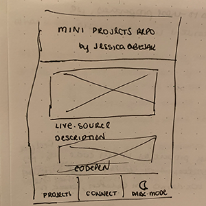
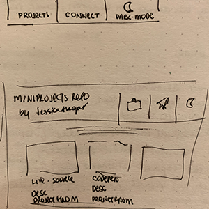
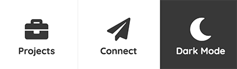
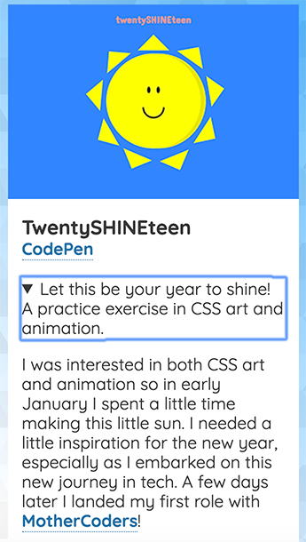

## The Original 24-Hour Portfolio

Before this project, I had originally wanted to create a quick, one-page tech portfolio in 24 hours, but soon I ended up becoming curious with Gatsby and decided to create a [portfolio with Gatsby](https://jessicagabejar.com/tech/jga-website) instead. After creating this site and writing a [blogpost on doing mini projects](https://dev.to/jessabejar/learn-to-code-by-building-messy-little-things-1h1m), I wanted to go back and do a static HTML/CSS/JS project, and thus the Mini Projects Repo came into fruition.

<aside>

<blockquote class="twitter-tweet">
A1: Personal projects, for me, are a chance to learn in a way where I can explore freely- have fun, make mistakes, be silly, and do things my own way at my own pace. They feel so important bc I invest so much in them, even small projects. <a href="https://twitter.com/hashtag/CodeNewbie?src=hash&amp;ref_src=twsrc%5Etfw">#CodeNewbie</a>
&mdash; Jessica 👩🏻‍💻💃🏻🧘🏻‍♀️ (@_jessicode) <a href="https://twitter.com/_jessicode/status/1136443680376655880?ref_src=twsrc%5Etfw">June 6, 2019</a></blockquote> 

</aside>

During a CodeNewbie chat on side projects, I mentioned working on mini side projects. When a fellow CodeNewbie asked what kind of projects I made, I listed many projects ranging from CSS animations to buttons and accordions to tutorial projects that went the extra mile.

I realized how much I loved and enjoyed my mini projects and how much I have learned from them. I wanted to properly house them somewhere, so I created the Mini Projects Repo, where I can showcase some of my favorite projects.

## Designing with Code

I began the process by drafting a quick paper wireframe. I knew I wanted to create a single page that displayed the mini projects in a grid. I also wanted a small navigation menu with three items: an anchor link to projects, an anchor link to a connect section with external links to my tech presence online, and a dark-mode button.

    <figure>
        
    </figure>
    <figure>
        
    </figure>

While I do recommend even going as far as creating a low-fidelity digital wireframe, I am glad that I even did a paper wireframe as I usually begin coding mini projects without giving design too much thought. My process is starting to evolve, and I am realizing the importance of designing before coding. It helps map out the MVP (minimum viable product) and can provide reference when you get stuck.

I began coding in CodePen and moved onto Visual Studio Code after deciding that I would like the responsive design to be mobile-first.

### SVG Background

I wanted to try SVGs. At first, I thought I could create my own SVG background, but then I found this [SVG background generator](https://svgbackgrounds.com). I decided learning to create my own SVG background can be reserved for another day and I can at least experiment with this generated background. I used my "tech" theme color as my accent color in the SVG background and throughout the page.

### Responsive Menu

I wanted to create a menu that exhibited different behaviors depending on browser size. At first I had wanted to create a menu that was fixed at the bottom but ultimately decided to leave the menu at the top of the page. I chose a fixed menu with button-like anchor links plus an actual button to change color themes; upon scrolling, the menu and its contents would shrink. This was my first time working with a script that triggered a function onscroll and that also used the window object. I found a code sample and refactored it to my needs and writing convention (ie: using `addEventListener()` and functions as named variables).

<aside>

#### Dark-Mode Button

I was extremely excited to include a dark-mode button, which I worked on previously as another mini project [(dark-mode button repo)](https://github.com/jessabejar/dark-mode-practice/). I use CSS variables to identify the colors that change and toggle between classes for the body of the document. Although I have yet to learn how to manage state so that users can maintain their preferences, I think this is a great start.

<figure>
    
</figure>

</aside>

### Connect Section

Before the Projects Section, I worked on coding the Connect Section, which was a flexbox that consisted of Font Awesome icons and links to all my tech-related platforms. I added a small CSS animation to give it a little pop!

### Projects Grid

I choose to use CSS Grid for my projects section. The width of this section is wider than the other sections and has no background color except for the text. Of all features that I used in this project, I was incredibly excited to use `
` and `
`. I didn't include this feature originally, but as I started writing, the contents of each card was getting longer than expected. I found this to be a great opportunity to use `
` and `
`, which I had learned about when studying web accessibility.

<aside>

#### Details and Summary

`
` and `
` are two semantic HTML tags that comes with a native toggle feature, allowing content to be expanded or collapsed. `
` acts as the main wrapper for the contents with `
` acting as the heading or displayed content and all other children elements of `
` acting as "hidden" elements that collapse or expand when the `
` is clicked. The default stylings also come with a caret that points right when collapsed and down when expanded. Focus remains on the `
` allowing the As this a native feature of this set of tags, all contents are accessible through screen readers; the closed and open starts are managed and announced.

<figure>
    
</figure>

</aside>

## In Summary

This was a fun 24-hour project where I was able to practice HTML/CSS/JS once again. I am happy that I was able to create the portfolio I had first envisioned for my tech projects and was able to use this to showcase my mini projects. As I continue to practice and make and redo mini projects, I look forward to growing my collection!