## Creating a Better Web Development Process

As the final project for Skillcrush's "Coding Responsive Websites" course, the task was to develop a responsive website based on the designs provided by a group of Photoshop files, which included images, fonts, colors, icons, and text content. The site is a three-page business site that includes features such as a navigation menu, footer with contact info and links to social media accounts, an FAQ section, and an embedded map.

While this was an opportunity to practice my development skills in responsive design, especially with Flexbox, I wanted to take this opportunity to **rethink my own web development process**. I wanted a much more systematic process of developing websites. I wanted an organized way of writing code initially so that few revisions are made during the process; however, if changes were necessary then I wanted to ensure that there was a quicker and smoother process for implementing them. I knew I also wanted to include web accessibility, and so determined that functionality should be separate from styling.

<figure>
    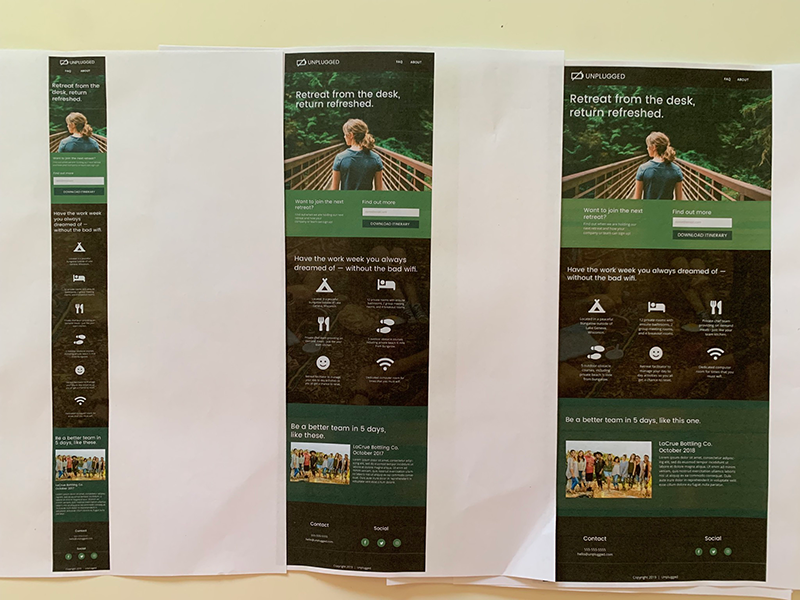
    <figcaption>Image: The printed design comps of the same webpage across different-sized browsers. Designs were created for three pages on three devices each.</figcaption>
</figure>

I found it necessary to prepare and examine the design files thoroughly, identifying key patterns in how content was presented, laid out, and styled. This also helped determine the role of each element and identify any landmarks. This would be particularly useful in coding the site in HTML only, a format that could easily assess if the website met basic web accessibility standards (I aimed for at least WCAG 2.0 Level A compliance).

**Styling** was also done systematically. Previously I had styled elements individually, finding only patterns in recurring elements like text headings. However, since my aim was to create a smoother development process, I decided to put the majority of my work in first identifying patterns. I sought out finding reusable UI patterns in layout, text, and styling. Finding patterns in layout meant creating less `
` elements and targeting similar elements using a class name. Understanding text patterns meant creating a new system for styling heading text that never compromised accessibility. Lastly, remaining styles were applied to individual elements; by that time, most styles had already been applied, leaving only unique properties of each element to be added.

This entire process helped not only in writing and styling content but also in **troubleshooting**. The process anticipated possible challenges before any code was written, and whenever a change needed to be made mid-process, the elements or actual code affected were only a few. It was a rather painless process to debug any issues. Using both Git and GitHub assisted with addressing issues and tracking progress and provided an outlet to explain why certain decisions were made, which unexpectedly helped me to understand my own coding patterns and development choices. A final QA check included validating code; checking for any other accessibility issues; testing across browsers, device sizes, and assistive devices; and auditing performance.

In the end, not only was I proud of the final product but I was extremely proud of the process that I had developed. I hope to use the process of building this project as the framework for how I complete all my processes in the future.

## Pre-Planning: HTML

After printing out the design comps, I identified the different parts of each page, dividing the website into components based on the content. I divided each page into a header, a main section, and a footer, with each of these sections broken down further into sub-sections. Each sub-section component was then broken down further into elements. I also took this opportunity to assign most of the components and elements a class or ID, to be used for CSS.

<figure>
    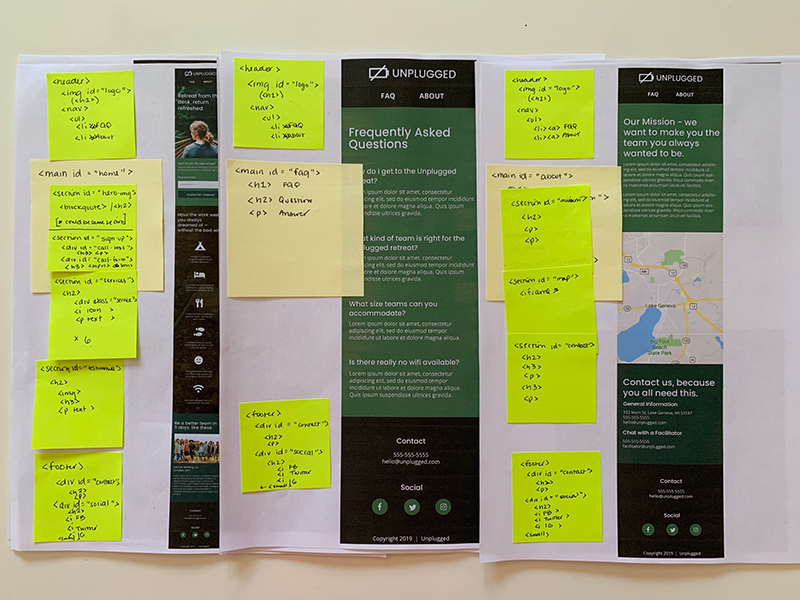
    <figcaption>Image: The printed design comps with accompanying sticky notes identifying the different components, elements, and the HTML tags to be used across the three pages of the site.</figcaption>
</figure>

<aside>

### Example: Header Component

For this project, the header was divided into a logo element and a navigation element. Navigation was further broken down into an unordered list with each link being a list item.

<figure>
    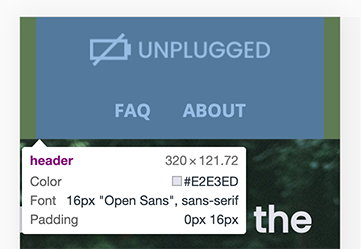
</figure>

</aside>

After identifying each element, I started comparing the layouts of each page across the different device sizes, in this case - mobile, tablet, and desktop layouts. This would later help in determining how to write media queries for each element, and because of that, it confirmed which elements should be grouped together.

<figure>
    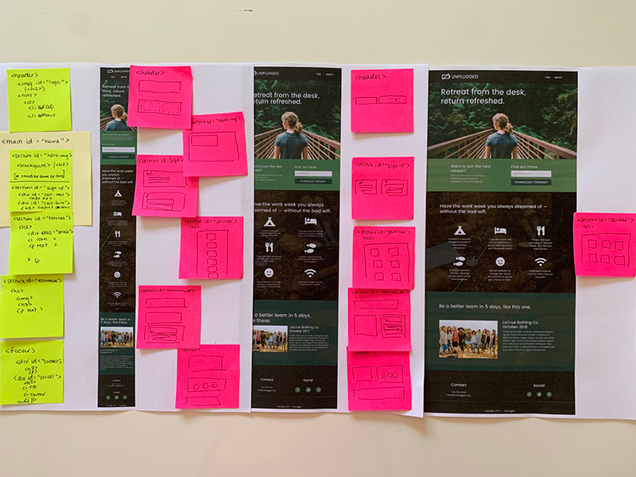
    <figcaption>Image: The printed design comps of the same webpage across different-sized browsers. The green sticky notes on the left of the design identify content and HTML. The pink sticky notes on the right of the design determine layout and subsequent changes in layout across different-sized browsers.</figcaption>
</figure>

<aside>

### Example: Services Component

The services component was one section that changed the most across browser sizes. In the mobile version it starts off as elements in a single column, moving to two columns in the tablet version, and three in the desktop version. Keeping this in mind, I had originally grouped the services elements separately and in its own single container; however, I later “ungrouped” them and made the entire services section component itself a flexible container. The heading remains at a 100% width while the single service elements fluidly change in width across browsers. Even with this minor change from group items to later grouping them in the larger container, pre-planning had allowed me to easily identify it and helped remove unnecessary, extraneous code in the process. 

<figure>
    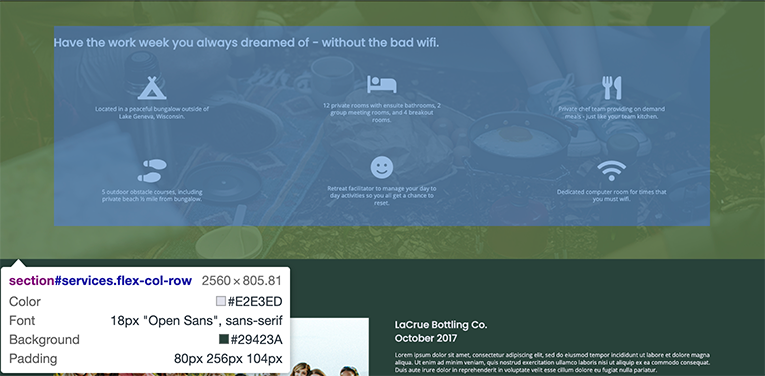
</figure>

</aside>

## Coding the HTML

After planning each page’s content and layout by pen and paper, the pages were then coded. The HTML5 Boilerplate was used to provide a framework for the website files. HTML was implemented first, using semantic HTML to ensure readability and accessibility. Comments were also included to separate and easily identify elements and components.

<figure>
    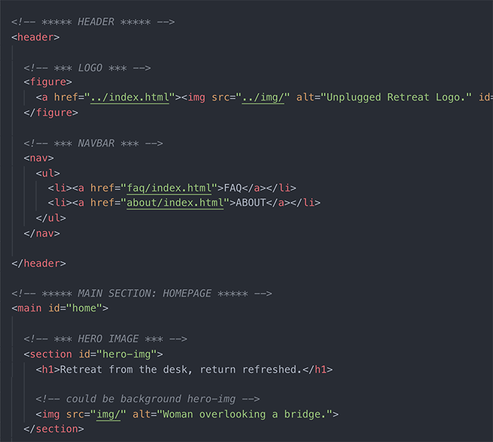
    <figcaption>Image: Text editor with early-implemented HTML code that includes comments identifying each section of the page as well as comments for future sections, elements, or content to be added.</figcaption>
</figure>

HTML was tested for errors using the Nu Html Checker. The site was also tested for accessibility using the ChromeVox and VoiceOver screenreaders as well as tested for keyboard accessibility manually. The website was viewed with HTML only to ensure that the content was still presented logically even without styling, allowing for users with limited or slow Internet to be able to access, navigate, and understand the content of the site.

<figure>
    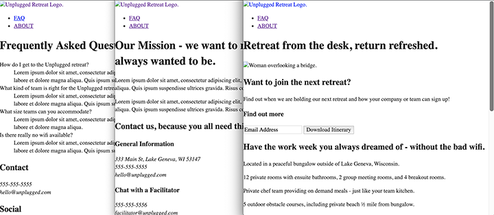
    <figcaption>Image: Each page of the Unplugged Retreat website in the browser, HTML only without CSS styling.</figcaption>
</figure>

<aside>

### Semantic HTML in Headings

Making sure that the content appeared in a logical manner was of utmost importance. As such, heading levels were used for function rather than for styling and were determined by order and context. As we will later see in the CSS - Text Styling section of this article, styled heading classes were created. In some instances, two headings could have the same styles in the design comp but were determined to be at different levels so that assistive technology can understand the information in a logical manner. For example, on the front page, the aside or complementary component had two headings one reading "Want to join the next retreat?" and "Find out more". They both had the same stylings and could have been in the same heading level. But in the context of the _entire_ page, it made more sense for the former heading to be at `<h2>` and the latter to be at `<h3>` to connect the content together. Then both were given the same heading class so that they have the same stylings.

</aside>

### GitHub Flow

The GitHub Flow is a process I use even as a single developer. A master branch is created at the lowest level (boilerplate with pages). Development takes place in a separate branch that is tracked on GitHub (one branch for HTML, a new one for CSS, plus a few other branches including clean-up and one for final features). The branch is then merged using a pull request, allowing me to easily compare changes and write comments and notes to myself to check for better solutions, to clean up blocks of code, to remind myself to test for accessibility, etc. Once approved, the branch is pulled into the remote master branch. The remote master is then fetched and merged into the local master branch. A pull request is usually made at each major feature, in this instance, one after all the HTML is written, one after all the CSS.

## Pre-Planning: CSS

The CSS is then planned out, mobile-first. The major part of determining how to style each component and element consists of identifying patterns. While I also identify each element’s individual style including flexible layout, font, color, and other features, I also compare the elements' stylings and identify patterns before code is written. Repeating patterns are given a class name for higher CSS specificity and to not affect semantic HTML and content logic. These patterns are then compiled into a library.

### Layout

The website was designed to have a responsive layout. The first part was determining which section components were flexible, meaning which had children whose width was fluid and whose layout and placement changed at certain breakpoints. The second step was to then determine the behavior of the child elements, for example, going from full-width (arranged in a single column) to half-width (arranged in two columns) or even one-third-width (arranged in three columns). Elements that exhibited similar behavior at certain breakpoints were given the same class name rather than simply assigning these properties and values to the element itself. Their behavior was observed going from mobile stylings first (acting as default styling), onto tablet styling, and finally desktop.

<figure>
    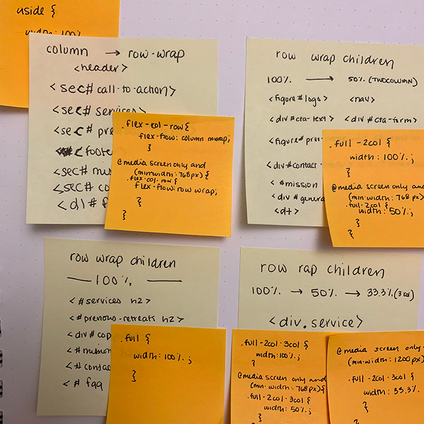
    <figcaption>Image: Post-it notes that identified patterns in layout behavior and breakpoints at which they changed. Elements were grouped by their mobile layout first.</figcaption>
</figure>

<aside>

### Flexbox Layout Naming Convention

When it came to layouts, I saw patterns for parent containers (most often sections that contained more than one element) and their children (individual elements). I grouped elements that exhibited similar behavior together. Their naming conventions & their behaviors are as follows:

- `.flex-column-row`: This is a class for parent elements whose children change widths and layouts depending on browser size. Its name refers to its display property (`flex`), its  initial flex-direction (`column`), and the flex-direction at the following breakpoint (`row` at the tablet breakpoint).
- `.full`: This is a class for a child element who's width is at 100% across all browsers.
- `.full-2col`: This is a class for a child element who's width begins at 100% and then changes to 50% at the next breakpoint. Most often it has a `.flex-column-row` parent, which means at the tablet breakpoint, these elements will line up in a row first before wrapping.
- `.full-2col-3col` (later changed to `.service`: This is a class for a child element who's width begins at 100%, changes to 50% at the tablet breakpoint, then changes to 33.3% at the desktop breakpoint. Since the service icons and descriptions were the only elements to exhibit such behavior, the class was changed to `.service` to keep code organized.

</aside>

<aside>

### Challenge: Margins and Padding

One of the challenges I faced was not considering margins and padding with the layout. I didn't notice this until after all styles were added and had imagined this to be a difficult process. But I approached this challenge in the same manner - looking at each element individually and then identifying any patterns. For the most part, most elements with the same flexbox behaviors also had the same margin and padding, so these values were added to that class. Elements with completely different margin and padding values had their values added specifically to those elements using ID names and other selectors of higher specificity.

</aside>

### Text Stylings

Determining text stylings was also a tedious process that involved identifying each text element’s styling including font-family, font-size, line-heighting, font-weight, text-decoration, text-transform, and text-align. These properties were also identified across each media query breakpoint.

<figure>
    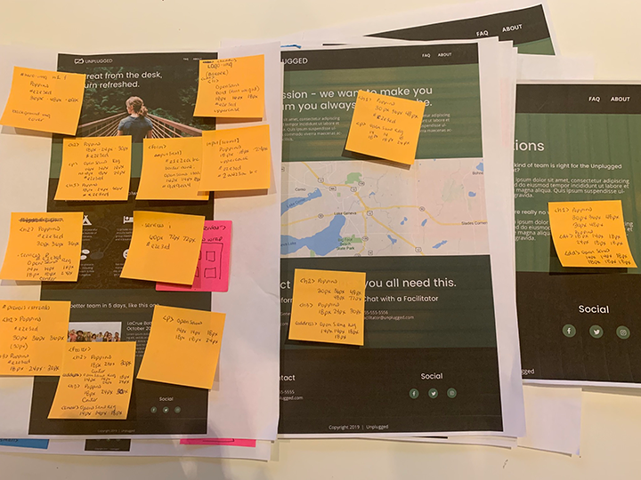
    <figcaption>Image: Post-its on printed design comps identifying CSS properties for each text element.</figcaption>
</figure>

Patterns were then identified based on these properties. After grouping the elements and defining a root font-size at each breakpoint, the font-sizes of each group were converted into rem. Then any repeating sizes (based on rem) from one breakpoint to another were determined; this was to ensure that code did not have to repeat if it was not needed, for example if a style remained 1rem from mobile to tablet, then no tablet styles needed to be written.

<figure>
    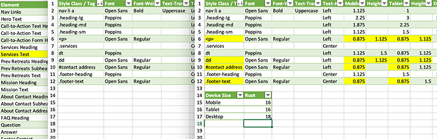
    <figcaption>Image: Spreadsheets grouping, sorting, and identifying text elements with similar property patterns. Font-family, font-size, line-height, text-transform, and text-align were some of the properties and values determined.</figcaption>
</figure>

<aside>

### Example: Heading Text Styles

As mentioned earlier, heading level was determined by logical presentation and was separate from styling. There were some heading elements with the same styling, but where their content was placed and their relationship with surrounding content often determined a different heading level. To avoid styling confusion, heading levels were left reset by the HTML5 boilerplate, while heading styles were applied to newly created classes. Heading styles were identified by the class names: `.heading-lg`, `.heading-md-lg`, `.heading-md`, and `.heading-sm`. The class `.heading-md-lg` was added later as it was discovered that a certain group of `.heading-md` headings became larger at larger breakpoints.

<figure>
    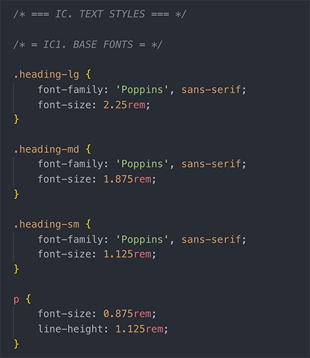
</figure>

</aside>

### Individual Styles

Individual styles were then determined last, this included properties and values of background images, forms, icons, maps, and definition lists.

## Coding the CSS

CSS was coded after each pre-planned section: layout, text styles, then individual styles. This process was chosen rather than coding all the CSS together as it would be easier to maintain, troubleshoot, and track issues if necessary.

Layout was coded first, starting mobile-first and then adding appropriate media queries. The site was quickly viewed using Chrome DevTools to test its behavior across browser sizes and devices.

Text styles were then added, followed by individual stylings. As mentioned earlier, margins and paddings were later added as they were initially left out by mistake.

## QA
The last part of the process was to do last minute checks on the website. These are some of the checks that were included (with links to the tools provided):
- Checking content for grammar and spelling errors (One way to check the content is by turning on a screen reader such as VoiceOver, JAWS, or ChromeVox to read your content)
- [HTML Validation](https://validator.w3.org/nu/)
- [CSS Validation](https://jigsaw.w3.org/css-validator/)
- Responsive design across devices : Chrome DevTools & [Matt Kersley's Responsive Design Tool](http://mattkersley.com/responsive/)
- Screenreader accessibility : [VoiceOver](https://www.apple.com/voiceover/info/guide/_1121.html) & [ChromeVox](https://www.chromevox.com/)
- Keyboard navigation (manually navigating a page with the keyboard only)
- Accessibility : [Wave](https://wave.webaim.org/) (live sites only)
- Accessibility : [AChecker](https://achecker.ca/checker/index.php) (live sites only)
- Performance, Accessibiity, Best Practices, & SEO Audits: [Lighthouse](https://developers.google.com/web/tools/lighthouse/)

Some accessibility issues, in particular, were related to design (such as low color contrast with the light green accent and lack of label on the form). Overall, I worked to make sure that the page was accessible, navigable, and easy to understand.

## In Summary
A plan to create a more systematic approach to design led to a speedier and efficient process. Design choices drove development, and understanding and identifying those design patterns created a smoother process for implementation and even troubleshooting. The process of breaking down design patterns but also identifying repetitive patterns and how they fit to the whole site helped in creating a page that is close to "pixel perfect." I imagine that my process for developing code from design comps would look similar in the future and that I'll be able to identify issues (such as forgotten margins and padding) earlier.